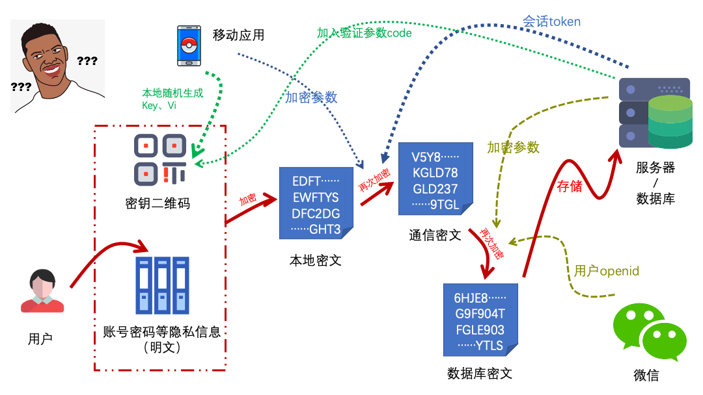

## 协议声明

这不是一个完全开源的项目。它允许个人下载用于学习、交流和个人部署使用，不可用于商业目的、注册商标、专利申请。允许fork代码和修改，基于此项目衍生的应用必须开源。

## License

it is not a completely open source project. It allows individuals to download for learning, communication and personal deployment. not be used for commercial purposes, registered trademarks and patent applications. Fork and modification are allowed. Applications derived from this project must be open source.

<hr />

## Hacker密码

### 前言

目前市面上大多数的密码管理器通常采用一个主密码作为应用密码，所有保存的账户密码等敏感信息采用服务端加密的方式保存下来，这种以一个密码来保护所有密码的方式。

当然这里并不是说目前采用这种方式的密码管理器就不安全， 越来越多的密码管理工具通过引入其他身份验证、用户行为分析等方式来保护您的账户安全。

Hacker密码更多的是一次尝试和实践，旨在用一种新的形式来探索密码保护。同时也希望通过开源透明的方式给更多有密码存储需要的用户一个值得信赖的选择。


## 加密逻辑（简图）



## 体验


`微信扫码体验`

<hr />

## 如何反馈您的问题

#### 开发者

> 如果您有关于项目上的漏洞、程序运行问题。 请在此仓库下提issue [ https://github.com/wahao/hacker-password-manager/issues ] 即可

#### 用户

> 您可以通过官方社区[ https://support.qq.com/products/137031 ] 进行反馈。 


## 项目结构

> 更新中

```

├── [2.6K]  README.md
├── [ 160]  docs                                    
│   ├── [157K]  encryptionProcess.png               - 加密流程
│   ├── [2.7K]  qrRecoverykey.md                    - 备份密钥
│   └── [2.8K]  qrkey.md                            - 密钥二维码
├── [ 704]  miniprogram                             
│   ├── [  96]  account                           
│   │   └── [ 448]  pages
│   │       ├── [4.0K]  detail.js                   
│   │       ├── [  27]  detail.json
│   │       ├── [2.1K]  detail.wxml
│   │       ├── [ 513]  detail.wxss
│   │       ├── [4.4K]  edit.js                     
│   │       ├── [  27]  edit.json
│   │       ├── [2.7K]  edit.wxml
│   │       ├── [ 459]  edit.wxss
│   │       ├── [2.4K]  share.js                   
│   │       ├── [  27]  share.json
│   │       ├── [1.6K]  share.wxml
│   │       └── [ 189]  share.wxss
│   ├── [ 256]  api                               
│   │   ├── [1.3K]  account.js
│   │   ├── [1.1K]  category.js
│   │   ├── [ 146]  index.js
│   │   ├── [1.0K]  key.js
│   │   ├── [ 558]  share.js
│   │   └── [1.0K]  user.js
│   ├── [  96]  app
│   │   └── [ 192]  pages
│   │       ├── [1.2K]  about.js
│   │       ├── [  27]  about.json
│   │       ├── [ 274]  about.wxml
│   │       └── [ 121]  about.wxss
│   ├── [ 733]  app.js
│   ├── [1.6K]  app.json
│   ├── [  15]  app.wxss
│   ├── [  96]  assets
│   │   └── [ 37K]  share.jpg
│   ├── [  96]  category
│   │   └── [ 192]  pages
│   │       ├── [1.3K]  apply.js
│   │       ├── [  30]  apply.json
│   │       ├── [ 610]  apply.wxml
│   │       └── [ 142]  apply.wxss
│   ├── [ 640]  components
│   │   ├── [ 192]  account-category
│   │   │   ├── [1.9K]  index.js
│   │   │   ├── [  51]  index.json
│   │   │   ├── [ 941]  index.wxml
│   │   │   └── [ 657]  index.wxss
│   │   ├── [ 192]  button
│   │   │   ├── [ 830]  index.js
│   │   │   ├── [  48]  index.json
│   │   │   ├── [ 586]  index.wxml
│   │   │   └── [ 756]  index.wxss
│   │   ├── [ 192]  clipboard-card
│   │   │   ├── [ 653]  index.js
│   │   │   ├── [  48]  index.json
│   │   │   ├── [ 338]  index.wxml
│   │   │   └── [ 334]  index.wxss
│   │   ├── [ 224]  empty
│   │   │   ├── [ 290]  index.js
│   │   │   ├── [  48]  index.json
│   │   │   ├── [ 171]  index.wxml
│   │   │   ├── [ 194]  index.wxss
│   │   │   └── [  96]  source
│   │   │       └── [117K]  no-data.png
│   │   ├── [ 192]  half-dialog
│   │   │   ├── [1.3K]  index.js
│   │   │   ├── [  48]  index.json
│   │   │   ├── [ 689]  index.wxml
│   │   │   └── [ 912]  index.wxss
│   │   ├── [ 256]  icon
│   │   │   ├── [ 393]  index.js
│   │   │   ├── [  48]  index.json
│   │   │   ├── [ 201]  index.wxml
│   │   │   ├── [ 148]  index.wxss
│   │   │   └── [ 160]  sources
│   │   │       ├── [ 672]  dark
│   │   │       │   ├── [3.0K]  add.png
│   │   │       │   ├── [7.6K]  app.png
│   │   │       │   ├── [ 12K]  archives.png
│   │   │       │   ├── [4.9K]  back.png
│   │   │       │   ├── [ 13K]  boom.png
│   │   │       │   ├── [7.6K]  close.png
│   │   │       │   ├── [4.6K]  copy.png
│   │   │       │   ├── [ 12K]  earth.png
│   │   │       │   ├── [ 10K]  fingerprint.png
│   │   │       │   ├── [5.5K]  home.png
│   │   │       │   ├── [6.9K]  list.png
│   │   │       │   ├── [7.5K]  refresh.png
│   │   │       │   ├── [ 11K]  restore.png
│   │   │       │   ├── [4.3K]  save.png
│   │   │       │   ├── [4.8K]  scan.png
│   │   │       │   ├── [ 13K]  share.png
│   │   │       │   ├── [4.0K]  success.png
│   │   │       │   └── [7.1K]  trash.png
│   │   │       └── [ 672]  white
│   │   │           ├── [3.2K]  add.png
│   │   │           ├── [8.5K]  app.png
│   │   │           ├── [ 16K]  archives.png
│   │   │           ├── [5.3K]  back.png
│   │   │           ├── [ 19K]  boom.png
│   │   │           ├── [8.2K]  close.png
│   │   │           ├── [4.8K]  copy.png
│   │   │           ├── [ 16K]  earth.png
│   │   │           ├── [ 15K]  fingerprint.png
│   │   │           ├── [5.9K]  home.png
│   │   │           ├── [7.5K]  list.png
│   │   │           ├── [8.2K]  refresh.png
│   │   │           ├── [ 16K]  restore.png
│   │   │           ├── [4.6K]  save.png
│   │   │           ├── [5.5K]  scan.png
│   │   │           ├── [ 16K]  share.png
│   │   │           ├── [4.2K]  success.png
│   │   │           └── [7.6K]  trash.png
│   │   ├── [ 192]  image-cropper
│   │   │   ├── [ 36K]  index.js
│   │   │   ├── [  23]  index.json
│   │   │   ├── [2.2K]  index.wxml
│   │   │   └── [1.8K]  index.wxss
│   │   ├── [ 256]  input
│   │   │   ├── [1.7K]  index.js
│   │   │   ├── [  96]  index.json
│   │   │   ├── [1.1K]  index.wxml
│   │   │   ├── [ 673]  index.wxss
│   │   │   └── [ 128]  sources
│   │   │       └── [ 14K]  upload.png
│   │   ├── [ 192]  layout
│   │   │   ├── [1.0K]  index.js
│   │   │   ├── [  90]  index.json
│   │   │   ├── [ 257]  index.wxml
│   │   │   └── [ 188]  index.wxss
│   │   ├── [ 192]  navigation
│   │   │   ├── [1.3K]  index.js
│   │   │   ├── [  48]  index.json
│   │   │   ├── [ 565]  index.wxml
│   │   │   └── [ 459]  index.wxss
│   │   ├── [ 192]  navigator
│   │   │   ├── [ 431]  index.js
│   │   │   ├── [  48]  index.json
│   │   │   ├── [ 376]  index.wxml
│   │   │   └── [ 255]  index.wxss
│   │   ├── [ 256]  network-image
│   │   │   ├── [ 620]  index.js
│   │   │   ├── [  48]  index.json
│   │   │   ├── [ 293]  index.wxml
│   │   │   ├── [ 103]  index.wxss
│   │   │   └── [ 128]  sources
│   │   │       └── [ 21K]  error.png
│   │   ├── [ 192]  painter
│   │   │   ├── [ 256]  lib
│   │   │   │   ├── [7.0K]  downloader.js
│   │   │   │   ├── [4.1K]  gradient.js
│   │   │   │   ├── [ 24K]  pen.js
│   │   │   │   ├── [ 25K]  qrcode.js
│   │   │   │   ├── [1.5K]  util.js
│   │   │   │   └── [ 11K]  wx-canvas.js
│   │   │   ├── [ 26K]  painter.js
│   │   │   ├── [  48]  painter.json
│   │   │   └── [1.3K]  painter.wxml
│   │   ├── [ 224]  qrkey
│   │   │   ├── [3.8K]  index.js
│   │   │   ├── [  95]  index.json
│   │   │   ├── [ 638]  index.wxml
│   │   │   ├── [ 224]  index.wxss
│   │   │   └── [1.9K]  qrTemplate.js
│   │   ├── [ 192]  qrscan
│   │   │   ├── [2.0K]  index.js
│   │   │   ├── [  48]  index.json
│   │   │   ├── [ 705]  index.wxml
│   │   │   └── [ 371]  index.wxss
│   │   ├── [ 224]  share-poster
│   │   │   ├── [3.0K]  index.js
│   │   │   ├── [  94]  index.json
│   │   │   ├── [1.1K]  index.wxml
│   │   │   ├── [ 154]  index.wxss
│   │   │   └── [2.8K]  posterTemplate.js
│   │   └── [ 192]  text
│   │       ├── [ 334]  index.js
│   │       ├── [  48]  index.json
│   │       ├── [ 117]  index.wxml
│   │       └── [ 236]  index.wxss
│   ├── [ 192]  config
│   │   ├── [ 634]  config.develop.js
│   │   ├── [  20]  config.release.js
│   │   ├── [  20]  config.trial.js
│   │   └── [ 794]  index.js
│   ├── [ 192]  custom-tab-bar
│   │   ├── [1.1K]  index.js
│   │   ├── [  48]  index.json
│   │   ├── [ 515]  index.wxml
│   │   └── [ 337]  index.wxss
│   ├── [ 320]  magics
│   │   ├── [3.4K]  ajax.js
│   │   ├── [1.2K]  crypto.js
│   │   ├── [  96]  libs
│   │   │   └── [2.0K]  mp-axios.js
│   │   ├── [2.9K]  qrKeyManage.js
│   │   ├── [3.1K]  qrRecoveryKeyManage.js
│   │   ├── [ 893]  updateManager.js
│   │   ├── [ 632]  util.js
│   │   └── [6.3K]  zip.js
│   ├── [  96]  miniprogram_npm
│   │   └── [ 128]  crypto-js
│   │       ├── [212K]  index.js
│   │       └── [256K]  index.js.map
│   ├── [  54]  package.json
│   ├── [  96]  pages
│   │   └── [ 448]  home
│   │       ├── [4.3K]  add.js
│   │       ├── [  27]  add.json
│   │       ├── [2.5K]  add.wxml
│   │       ├── [ 452]  add.wxss
│   │       ├── [2.0K]  list.js
│   │       ├── [  60]  list.json
│   │       ├── [ 672]  list.wxml
│   │       ├── [ 379]  list.wxss
│   │       ├── [1.4K]  my.js
│   │       ├── [  27]  my.json
│   │       ├── [2.2K]  my.wxml
│   │       └── [ 430]  my.wxss
│   ├── [2.4K]  project.config.json
│   ├── [ 191]  sitemap.json
│   ├── [ 806]  theme.wxss
│   └── [  96]  tools
│       └── [ 192]  pages
│           ├── [2.7K]  recovery.js
│           ├── [  27]  recovery.json
│           ├── [2.5K]  recovery.wxml
│           └── [ 404]  recovery.wxss
└── [ 128]  screenshots
    └── [257K]  gh_72a49c29672c_1280.jpg


```
