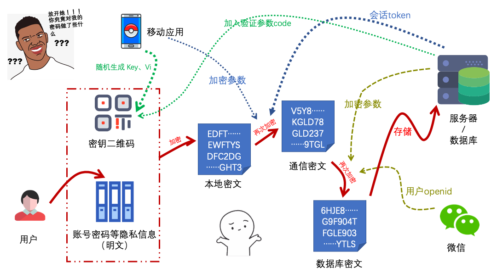

## 协议声明

这不是一个完全开源的项目。它允许个人下载用于学习、交流和个人部署使用，不可用于商业目的、注册商标、专利申请。允许fork代码和修改，基于此项目衍生的应用必须开源。

## License

it is not a completely open source project. It allows individuals to download for learning, communication and personal deployment. not be used for commercial purposes, registered trademarks and patent applications. Fork and modification are allowed. Applications derived from this project must be open source.

<hr />

## Hacker密码

该项目将开源所有的前端和服务端代码、加解密流程、结构设计。

所有代码及设计逻辑正在整理中，即将上传....

最终版本正在测试，即将开放内测...

### 计划表

> 预计1月20日  开放小程序体验

> 预计1月21日前  整理好文档类说明

> 预计1月23日前  完成内测版本问题修复，并正式上线

> 预计1月25日前  整理好代码类文件并同步仓库

### 介绍

目前市面上大多数的密码管理器通常采用一个主密码作为应用密码，所有保存的账户密码等敏感信息采用服务端加密的方式保存下来，这种以一个密码来保护所有密码的方式。

当然这里并不是说目前采用这种方式的密码管理器就不安全， 越来越多的密码管理工具通过引入其他身份验证、用户行为分析等方式来保护您的账户安全。

Hacker密码更多的是一次尝试和实践，旨在用一种新的形式来探索密码保护。同时也希望通过开源透明的方式给更多有密码存储需要的用户一个值得信赖的选择。


## 项目结构

> 更新中

```

.
├── [2.1K]  README.md                             
├── [ 128]  docs                                   - 文档说明
│   ├── [2.7K]  qrRecoverykey.md                   - 备份密钥
│   └── [2.8K]  qrkey.md                           - 密钥二维码
└── [ 128]  screenshots                   
    └── [257K]  gh_72a49c29672c_1280.jpg


```

## 加密逻辑（简图）



## 体验

暂时无法体验，建议先加收藏哦~~


`微信扫码体验`

<hr />

## 如何反馈您的问题

#### 开发者

> 如果您有关于项目上的漏洞、程序运行问题。 请在此仓库下提issue [ https://github.com/wahao/hacker-password-manager/issues ] 即可

#### 用户

> 您可以通过官方社区[ https://support.qq.com/products/137031 ] 进行反馈。 


